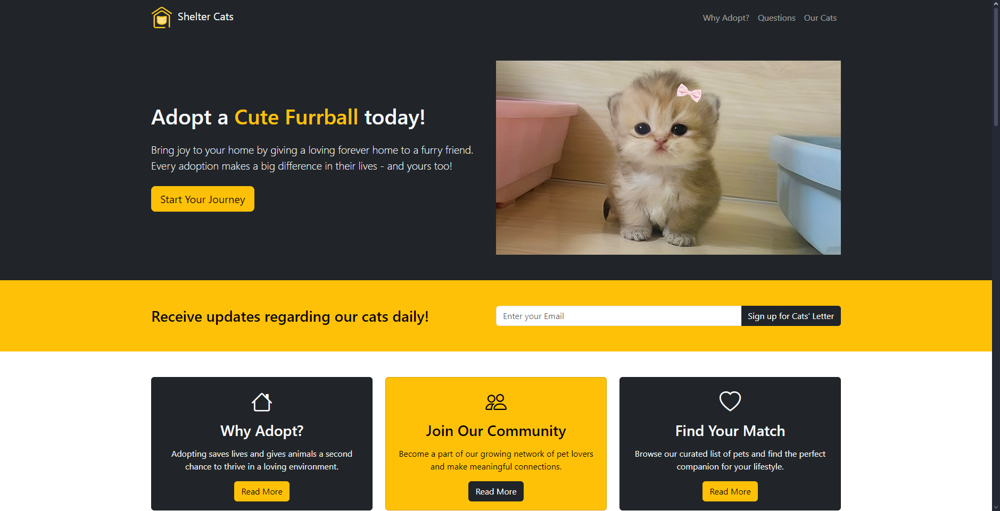

<h1>Shelter Cats Adoption Website</h1>

The <strong>Shelter Cats</strong> website is designed to promote the adoption of cats and provide information to potential adopters. It features a user-friendly interface, informative sections about the adoption process, and a showcase of available cats.

## Website Status & URL

 
You can view the live version of the website at [https://shelter-cats.netlify.app](https://shelter-cats.netlify.app).

<h2>Features</h2>
<ul>
<li><strong>Responsive Design</strong>: The website is fully responsive and works well on various devices.</li>
<li><strong>Adoption Information</strong>: Clear guidelines on how to adopt a pet, including FAQs.</li>
<li><strong>Cat Profiles</strong>: Detailed profiles of available cats with images and descriptions.</li>
<li><strong>Newsletter Signup</strong>: Users can sign up for updates about the cats.</li>
<li><strong>Contact Information</strong>: Easy access to contact details for inquiries.</li>
<li><strong>Fun Intended</strong>: Features some of the famous meme cats as adoption ready.</li>
</ul>

<h2>License</h2>

This project is licensed under the MIT License. See the <a href="LICENSE">LICENSE</a> file for details.

<h2>Tools used</h2>
<ol>
<li>Visual Studio Code</li>
<li>HTML5</li>
<li>CSS</li>
<li>JavaScript</li>
<li>Bootstrap</li>
<li>Netlify</li>
</ol>

<h2>Link to Tools</h2>

&emsp;
&emsp;
&emsp;
&emsp;
&emsp;
&emsp;

<h2>Developer</h2>
<ul>
<li><a href="https://github.com/QwertyFusion">[@QwertyFusion]</a></li>
</ul>
